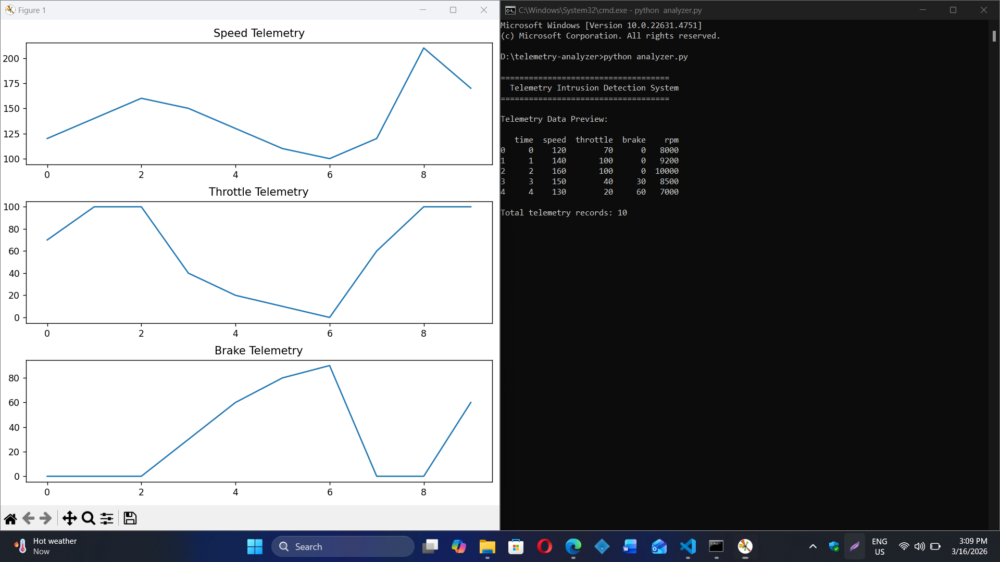
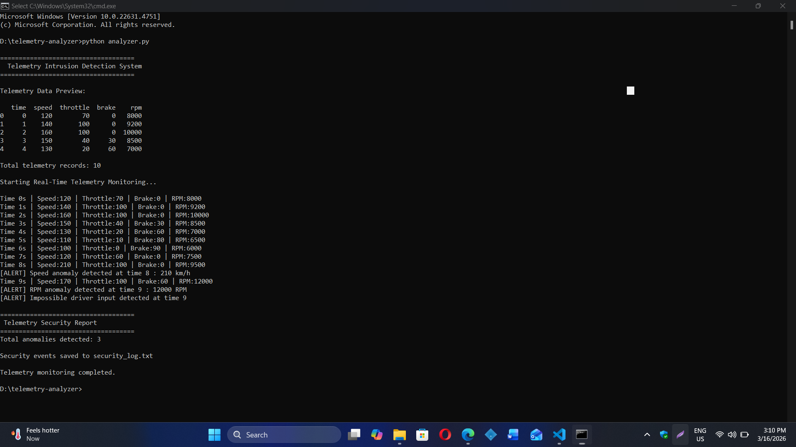

# Telemetry Intrusion Detection System (TIDS) 

## Project Overview

The **Telemetry Intrusion Detection System (TIDS)** is a Python based monitoring system designed to analyze vehicle telemetry data and detect abnormal behavior that may indicate **sensor failures, telemetry manipulation, or cybersecurity threats**.

Telemetry systems are widely used in **motorsport, automotive engineering, autonomous vehicles, and aerospace systems** to monitor vehicle performance in real time.

This project simulates a simplified **motorsport telemetry monitoring system** capable of detecting suspicious telemetry patterns.

---

## Why This Project Matters

Modern vehicles and race cars generate massive amounts of telemetry data including:

* Vehicle speed
* Engine RPM
* Throttle position
* Brake pressure

If this data becomes **corrupted, manipulated, or abnormal**, it may indicate:

* Sensor malfunction
* Cybersecurity attacks
* Telemetry spoofing
* Driver input anomalies

This project demonstrates a **basic telemetry security monitoring system** similar to those used in **automotive cybersecurity and motorsport engineering environments**.

---

## Features

* Telemetry data analysis using Python
* Real time telemetry monitoring simulation
* Data visualization dashboard
* Anomaly detection system
* Detection of impossible driver inputs
* Security alert system
* Security event logging
* Telemetry security report generation

---

## Technologies Used

| Technology  | Purpose                   |
| ----------- | ------------------------- |
| Python      | Core programming language |
| Pandas      | Telemetry data processing |
| Matplotlib  | Data visualization        |
| CSV Dataset | Telemetry data simulation |

---

## Project Structure

```
Telemetry-Intrusion-Detection-System
│
├── analyzer.py
├── telemetry_data.csv
├── security_log.txt
├── README.md
│
├── screenshots
│   ├── telemetry_dashboard.png
│   └── anomaly_detection_output.png

```

---

## System Architecture

```
Telemetry Data Source (CSV)
        ↓
Telemetry Analyzer (Python)
        ↓
Real-Time Monitoring Engine
        ↓
Anomaly Detection System
        ↓
Security Alert System
        ↓
Security Log File
```

The system continuously monitors telemetry values and detects abnormal conditions.

---

## Telemetry Parameters Analyzed

| Parameter | Description                    |
| --------- | ------------------------------ |
| Speed     | Vehicle speed (km/h)           |
| Throttle  | Accelerator pedal position (%) |
| Brake     | Brake pressure (%)             |
| RPM       | Engine revolutions per minute  |

---

## Detected Anomalies

The system detects the following abnormal conditions:

* Speed values exceeding safe limits
* Engine RPM spikes
* Abnormal brake pressure
* Impossible driver input (high throttle and brake simultaneously)

These anomalies may indicate:

* telemetry spoofing
* sensor malfunction
* system malfunction
* cybersecurity attacks

---

## Screenshots

### Telemetry Dashboard



---

### Intrusion Detection Output



---

## Attack Simulation

This project simulates telemetry cyber-attacks by injecting abnormal values into the dataset, mimicking CAN Bus message injection attacks.

### Simulated Attacks:
- Sudden speed spike
- RPM manipulation
- Brake override
- Impossible driver input

The system detects these anomalies in real time using rule-based detection.
## Real-World Applications

Telemetry monitoring systems are used in many industries:

* Motorsport telemetry monitoring
* Automotive cybersecurity systems
* Autonomous vehicle diagnostics
* Industrial equipment monitoring
* Aerospace telemetry systems

This project demonstrates fundamental concepts used in **vehicle telemetry monitoring and cybersecurity anomaly detection systems**.

---

## Skills Demonstrated

* Python programming
* Data analysis using Pandas
* Data visualization using Matplotlib
* Telemetry monitoring systems
* Anomaly detection techniques
* Cybersecurity monitoring concepts

---

## Future Improvements

Potential improvements for the system include:

* Real-time telemetry streaming
* CAN Bus intrusion detection integration
* Machine learning anomaly detection
* Web based telemetry dashboard
* Advanced telemetry attack simulations

---

## Author

Cybersecurity student focusing on **automotive cybersecurity, telemetry analysis, and motorsport systems**.
